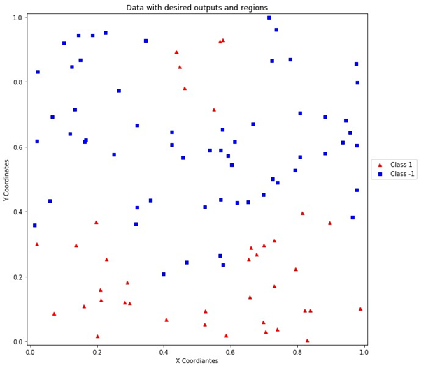

# Support Vector Machine

This python program implements the Support Vector Machine (SVM) to classify the generated data into two classes. The program using the cvxopt library for solving the quadratic optimization problem. The data is generated by drawing 100 points independently and uniformly at random from [0, 1]. The equation for the desired output  for the input [xi1, xi2] is given below in python syntax:

```python
if xi2 < 0.2*sin(10*xi1) + 0.3 or (xi2 - 0.8)**2 + (xi1 - 0.5)**2 < 0.15**2:
	di = 1
else:
	di = -1
```


## Kernels

* Since the problem is **not** linearly classifiable, linear kernel SVM is not used.
* There are three types of kernel:
  1. Linear Kernel
  2. Polynomial Kernel
  3. Gaussian Kernel
* I have implemented polynomial kernel and gaussian kernel with different hyper-parameters
* The plots for different kernels are given below:


## Results

### 1. Input

---




### 2. For Polynomial Kernel with p = 2 and p = 3, the Quadratic Programming library could not find the optimal solution. 

---


### 3. For Polynomial Kernel with p = 4:

---


### 4. For Polynomial Kernel with p = 10: As p was increased, the algorithm tries to overfit the data.

---


### 5. For Gaussian Kernel with sigma = 1: Could not find solution and terminated. 

---


### 6. For Gaussian Kernel with sigma = 2: 

---


## Refer

1. [SVM](https://en.wikipedia.org/wiki/Support_vector_machine)
2. [cvxopt library](http://cvxopt.org/)

## Libraries Used

1. cvxopt is used for solving quadratic optimization problem.
2. Numpy library is used to store and manipulate the data.
3. Matplotlib is used in order to plot the results.
